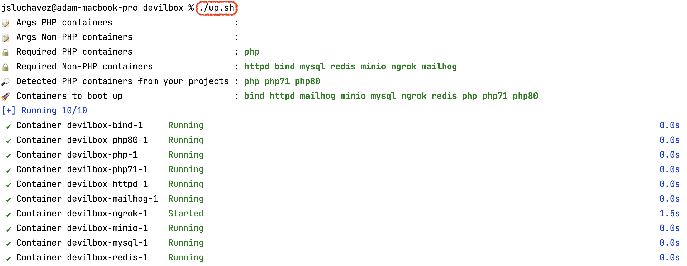

# LAZYBOX, a Simplified Devilbox for Web Development

This is just a fork of [Devilbox](https://github.com/cytopia/devilbox) so a huge thanks to the awesome team behind it! 🩷
<br/>
<br/>
So what's new with this forked copy? I added what I prefer to call as "workflows".<br/>
For example, if you want to create a new Laravel application, you can just call the "laravel_new" ✨ command.<br/>
It will then ask you your preferred app name, Laravel version, and PHP version.<br/>
It will then create necessary folders, then symlink some stuff, and probably make some Devilbox specific configs.
<br/>
<br/>
Why? Simply because Devilbox will automatically run your apps based on those configs.<br/>
Quite complicated for beginner, right? Which is why I made it my goal to simplify some things up. 🚀<br/>
<br/>
Here's a list of apps that I planned to add workflows for:
<br/>
<br/>
🐘 PHP Apps
- [x] Laravel
- [x] Lumen
- [x] Symfony
- [ ] CodeIgniter
- [ ] WordPress
- [ ] Drupal
- [x] Yii
- [ ] CakePHP
- [ ] Slim
- [ ] Framework X

🍀 NodeJS Apps
- [x] Vite (which includes Vanilla, Vue, React, Preact, Lit, and Svelte)
- [x] NextJS
- [x] GatsbyJS
- [x] AstroJS
- [ ] Strapi

🐘 Python Apps
- [ ] Django

Unfortunately, you can't make a PR on this GitHub repo since this is just a mirrored copy from somewhere else. 😔<br/>
Worry not because you can just create a "New Discussion" if you want to request a framework support. 😇<br/>
<br/>
If you want to read more about Devilbox, please take a look at the original [README](DEVILBOX.md) or visit the [official documentations](https://devilbox.readthedocs.io).

## Installation

```shell
# Clone via HTTP
git clone https://github.com/luchavez-technologies/lazybox.git lazybox

# Or, clone via SSH
git clone git@github.com:luchavez-technologies/lazybox.git lazybox

# Change directory to Devilbox's folder
cd lazybox

# Invoke the "up" script to start Devilbox
./up.sh

# The containers that will be booted up by default are "bind", "httpd", "mailhog", "minio", "mysql", "ngrok", "redis", and "php".
# The "php" in this case refers to PHP 8.1 which you can change by editing the ".env" file.

# Or, if you want to also run the other PHP containers aside from the default, you may do this...
./up.sh php54 php55 php56 php70 php71 php72 php73 php74 php80 php81 php82

# Or, if you added your own Docker container on "docker-compose.override.yml", you may do this...
./up.sh some-custom-container
```

If everything works, you should be able to see this... ✨



Afterward, you should be able to see this welcome screen... ✨


## Project Structure


## Usage

In this section, you can learn all the available commands that you can use to start up your apps. Let's get to it then! 😉

### Available Shell Scripts

| Command | Script      | Description                                                              |
|---------|-------------|--------------------------------------------------------------------------|
| Up      | `./up.sh`   | Boots up the PHP and non-PHP containers                                  |
| Stop    | `./stop.sh` | Stops all running PHP and non-PHP containers.                            |
| Down    | `./down.sh` | Stops and deletes all containers with their data. Use this with caution! |

### Available Devilbox Shell Scripts

#### Main Functions

| Alias           | What does it do?                                                         |
|-----------------|--------------------------------------------------------------------------|
| `laravel_new`   | Creates a new Laravel app using `composer` inside the specified `vhost`. |
| `laravel_clone` | Clones a new Laravel app using `git` inside the specified `vhost`.       |
| `next_new`      | Creates a new NextJS app using `npx` inside the specified `vhost`.       |
| `next_clone`    | Clones a new NextJS app using `git` inside the specified `vhost`.        |
| `gatsby_new`    | Creates a new GatsbyJS app using `npx` inside the specified `vhost`.     |
| `gatsby_clone`  | Clones a new GatsbyJS app using `git` inside the specified `vhost`.      |
| `vite_new`      | Creates a new ViteJS app using `npx` inside the specified `vhost`.       |
| `vite_clone`    | Clones a new ViteJS app using `git` inside the specified `vhost`.        |
| `astro_new`     | Creates a new AstroJS app using `npx` inside the specified `vhost`.      |
| `astro_clone`   | Clones a new AstroJS app using `git` inside the specified `vhost`.       |

#### Other Functions

| Alias                | What does it do?                                                        |
|----------------------|-------------------------------------------------------------------------|
| `symlink`            | Symlinks the `public` directory of your app to your `vhost`'s `htdocs`. |
| `php_change`         | Changes the PHP container of a `vhost`.                                 |
| `php_default`        | Changes the PHP container of a `vhost` to `default`.                    |
| `port_change`        | Changes the port number of a `vhost` for reverse proxy.                 |
| `setup_ngrok`        | Set the Ngrok auth token and vhost to to expose to the web.             |
| `setup_laravel_mix`  | Add a `Laravel Mix HMR` websocket and a guide for additional changes.   |
| `setup_laravel_vite` | Add a `Laravel Vite HMR` websocket and a guide for additional changes.  |
| `setup_laravel_vite` | Add a `Laravel Vite HMR` websocket and a guide for additional changes.  |
| `setup_start_script` | Add a `Laravel Vite HMR` websocket and a guide for additional changes.  |

**Note #1**: These bash aliases are only usable inside the Devilbox terminal.<br/>
**Note #2**: These bash aliases can be found at the [bash folder](bash). You are free to add your own bash aliases or modify existing ones.<br/>
**Note #3**: These bash aliases will ask for user input when no arguments are provided.<br/>
**Note #4**: Make sure the PHP version of Devilbox terminal matches the to-be-created or to-be-cloned Laravel app.

## Minio as S3

Here's the bucket policy to make a `private-public` filesystem architecture on the Minio setup.

```
{
    "Version": "2012-10-17",
    "Statement": [
        {
            "Effect": "Deny",
            "Principal": {
                "AWS": [
                    "*"
                ]
            },
            "Action": [
                "s3:GetBucketLocation",
                "s3:ListBucket"
            ],
            "Resource": [
                "arn:aws:s3:::<your-bucket-name>"
            ]
        },
        {
            "Effect": "Allow",
            "Principal": {
                "AWS": [
                    "*"
                ]
            },
            "Action": [
                "s3:GetObject",
                "s3:PutObject",
                "s3:DeleteObject"
            ],
            "Resource": [
                "arn:aws:s3:::<your-bucket-name>/public/*"
            ]
        }
    ]
}
```

## FAQs

#### 1. How to switch to a terminal with different PHP version?

To switch to a terminal with different PHP version, just add PHP container name after the `Up` script like this: `./up.sh php74`.<br/>
Refer to [docker-compose.override.yml](docker-compose.override.yml) for available PHP container names.<br/>
<br/>
If you will run multiple PHP versions, the first argument will be chosen for the PHP version of Devilbox terminal.<br/>
Example: Running `./up.sh php74 php80 php81` will open a terminal with PHP 7.4.

#### 2. How to run `redis` and/or `mysql`?

To run Redis and/or MySQL databases, just add them at the very end when you run the `Up` script like this: `./up.sh php74 mysql redis`.<br/>

#### 3. How to run `ngrok`?

To run Ngrok, just add it at the very end when you run the `Up` script like this: `./up.sh php74 ngrok`<br/>
Btw, the token used is mine so please replace it. You can find it at the very bottom of the [.env](.env) file.<br/>
I just followed this [official documentation](https://devilbox.readthedocs.io/en/latest/custom-container/enable-ngrok.html) from Devilbox when setting up Ngrok. Please refer to that if you encounter an issue.

#### 4. How to run `minio`?

To run Minio, just add it at the very end when you run the `Up` script like this: `./up.sh php74 minio`<br/>
Minio is an S3-compatible storage service. You can use it for local development if you don't have an S3 instance yet.

#### 5. How to fix multiple NodeJS apps trying to run on the same port number?

When running multiple NodeJS apps at the same time, there is a possibility that the designated port number is already taken.
And if the port is already taken, it's possible that when you visit your app, it will display the other app or show a Nginx error.
That is because your app's Devilbox config should be updated with the port change.

To fix this, just run the `port_change` bash function. It will ask for your app's `vhost name` and `port number` where it is currently running.
Don't forget to press `Reload` on `C&C` page afterward.

## Questions

If you have questions, feel free to send an email at [`jamescarloluchavez@gmail.com`](mailto:jamescarloluchavez@gmail.com).
